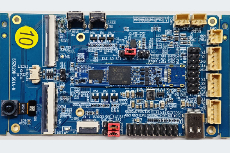

# Comake Pi D2

本仓库收录 **Comake Pi D2** 的公开资料，原项目地址：

https://p.eda.cn/d-1377570469779079168

## 项目简介



Comake Pi D2 是星宸科技发布的低功耗轻量级端侧 AI 开发板，面向便携类相机、可穿戴设备、智能家居、无人机等应用市场。

## 基本信息

| 项目 | 内容 |
| --- | --- |
| 项目名称 | Comake Pi D2 |
| 原页面标题 | 星宸科技AI开发板 Comake Pi D2 |
| 项目作者 | 星宸科技(SigmaStar) |
| 发布时间 | 2026-05-29 16:59:14 |
| 关键词 | 嵌入式系统, 开发板, 人工智能, 华秋开源硬件社区 |
| 开源协议 | GPL 3.0 |

## 项目特性

- 2 核 A32 1GHz CPU，配合 200MHz Cortex-M4 协处理器。
- 1.5T NPU 算力，支持主流开源框架模型转换，包括 ONNX、Caffe、TensorFlow、TFLite 等。
- 内置 256MB LPDDR4x，系统为 Linux。
- 支持 MIPI RX、UART、FUART、I2C、SPI、PWM、SARADC、USB 2.0、EMMC/SDIO、RTC 等外设接口。
- 支持安防级 ISP、硬件 H.264/H.265 编码和丰富的 Audio Processor 能力。
- 目标应用包括便携类相机、智能眼镜/智能摄像耳机、智能门锁/门铃/猫眼、宠物机器人、FPV 无人机等。

## 仓库目录

```text
.
├── assets/images/                 # 项目图片
├── docs/                          # 用户指南与资料阅读指南
├── enclosure/                     # 外壳/结构件说明
├── hardware/
│   ├── bom/                       # BOM / 元件清单
│   └── pcb/                       # PCB、原理图、硬件说明和设计包
├── MANIFEST.json                  # 原始附件来源、大小和 SHA256
└── README.md
```

## 硬件资料

硬件资料包含 V1.0/V2.0 Demo 设计包、V2.0 核心板和载板设计包、BOM、硬件说明、IO 资源分配表、HW Checklist，以及解压后的 `.pcb`、`.DSN`、PDF 等设计文件。

请优先查看 `hardware/pcb/Comake-Pi-D2-V2.0_BGA8_9.5_Demo_20260409.zip` 及其解压目录；如需单独查看核心板或载板，可分别查看 `Comake-Pi-D2-V2.0_核心板` 和 `Comake-Pi-D2-V2.0_载板` 相关资料。

## 文档资料

`docs/` 目录包含：

- `SSC309QL_HW_USER_GUIDE_20251225.pdf`
- `资料阅读指南V1.1.pdf`

## 外壳与结构件

当前公开资料中未单独识别到 `.stl`、`.step`、`.stp`、`.iges` 等结构件文件，`enclosure/` 目录仅保留说明文件。上传前建议再人工检查解压内容中是否夹带结构件资料。

## 文件说明

| 路径 | 内容 |
| --- | --- |
| `assets/images/cover.png` | 项目封面图 |
| `hardware/bom/SSZ029D-S01D-D2_BOMLIST20260414.xlsx` | D2 BOM / 元件清单 |
| `hardware/bom/SSZ029D-S01D-D2_MAINBOARD_BOMLIST20260414.xlsx` | Mainboard BOM / 元件清单 |
| `hardware/pcb/Comake PI D2 V2.0硬件说明_20260409.docx` | V2.0 硬件说明 |
| `hardware/pcb/WQ7036平台硬件IO资源分配表.xlsx` | WQ7036 平台硬件 IO 资源分配表 |
| `hardware/pcb/Comake-Pi-D2-V1.0_BGA8_9.5_Demo_20251215.zip` | V1.0 Demo 硬件设计包 |
| `hardware/pcb/Comake-Pi-D2-V2.0_BGA8_9.5_Demo_20260409.zip` | V2.0 Demo 硬件设计包 |
| `hardware/pcb/Comake-Pi-D2-V2.0_核心板.zip` | V2.0 核心板设计包 |
| `hardware/pcb/Comake-Pi-D2-V2.0_载板.zip` | V2.0 载板设计包 |
| `hardware/pcb/SSC309QL_BGA8_9.5_LPDDR4x For AI Glass_HW Checklist V1.2 .xlsx` | SSC309QL 硬件检查清单 |
| `docs/SSC309QL_HW_USER_GUIDE_20251225.pdf` | SSC309QL 硬件用户指南 |
| `docs/资料阅读指南V1.1.pdf` | 资料阅读指南 |

## 使用建议

1. 先检查 `README.md` 的标题、协议、图片和文件说明是否正确。
2. 硬件设计请优先查看 `hardware/pcb/` 下的 PCB、原理图工程和设计包。
3. BOM 请查看 `hardware/bom/`。
4. 文档资料请查看 `docs/`。
5. 解压后的内容仅用于归档浏览，上传前请确认没有不应公开的文件。
6. 确认 README 后，再创建或更新 GitHub 仓库并上传。

## 开源协议

本仓库开源协议为 **GPL 3.0**。版权、商标、许可证和使用风险以原项目方及附件内声明为准。
